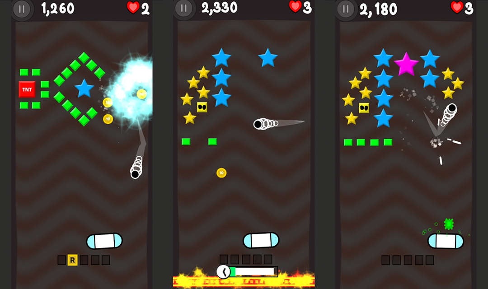

# Cinder

 
    

The complete Unity3D open source to a 'brick breaker' clone game by Terry Paton. Originally written in 2016, now updated (in late 2020) to the new standards Terry has learnt since then.

This game was developed as a rapid prototype using hand drawn art as a placeholder to other graphics. The major gimmick to the game, aside from the powers are the 'bosses', essentially large bricks that need multiple hits.

Available to play in the Android google play store: <a href="https://play.google.com/store/apps/details?id=com.terrypaton.cinder"> Cinder </a>

## How to I open it?
Using Unity 2019.4+ open the project in the folder, 'Cinder'. Press play. The game is setup that it requires the scene 'Loading' to be run first. There is a tool for navigating to the games scenes. You can find this under the menu Cinder > Cinder Window

# Why?
The primary focus is as a portfolio piece. Often my paid work is NDA and I can't show anything when looking for new opportunities. So its a little sampling of what I can do, squeezed in after work and between life.

## Notes
- The game has been developed as an Android only game, but could be easily ported to iOS.

 
    

